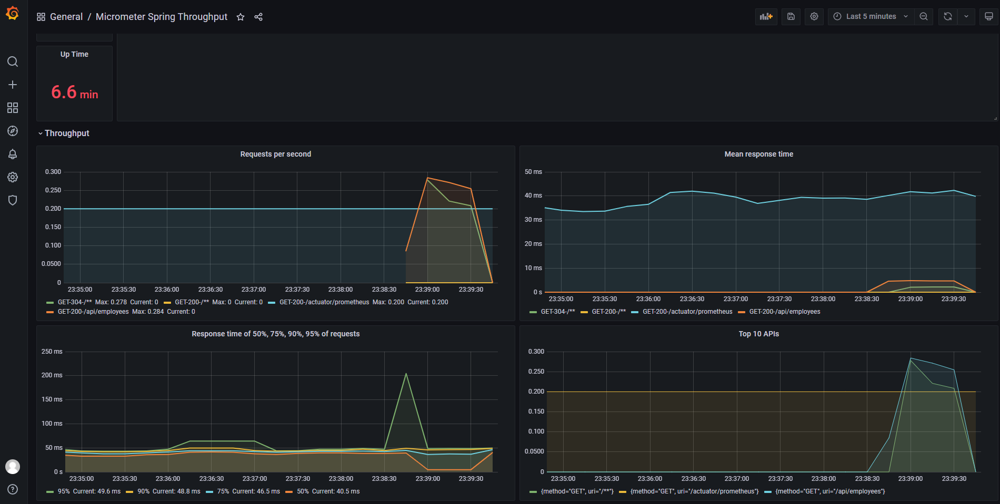

# SimpleWebApp
REST-сервис, предоставляющий интерфейс для работы с базой данных сотрудников.

## Описание
При создании приложения были использованы:
- Spring Boot
- Spring Data JPA
- В качестве базы данных - PostgreSQL
- Сборщик Maven
- Для запуска используется Docker
- Логирование с помощью Slf4j и logback
- OpenAPI документация
- JUnit, Mockito и Testcontainers для тестирования
- Liquibase для миграций
- ActiveMQ в качестве брокера сообщений
- Prometheus и Grafana для мониторинга состояния  
- Vue.js для UI

Сервис реализует методы для работы с базой сотрудников, описанные в [протоколе](https://github.com/KirillovAlexander/SimpleWebApp/blob/master/openapi.yaml).

По умолчанию приложение запускается по адресу `http://localhost:8080/`.

Rest-сервис для интеграции со сторонними приложениями доступен по адресу `http://localhost:8080/api/employees`.

## Запуск приложения
Для запуска приложения необходимо склонировать репозиторий, открыть корневую папку проекта и выполнить команду `mvn package`.
После этого необходимо запустить сервис с помощью команды `docker-compose up -d`. Docker автоматически соберет и запустит следующие образы:
 - Postgres
 - ActiveMQ
 - Grafana
 - Prometheus
 - Непосредственно само приложение

## Swagger UI
После запуска приложения по адресу `http://localhost:8080/swagger-ui.html` доступна OpenAPI 3 документация.

## Изменение уровня логирования
По эндпоинту `localhost:8080/actuator/loggers/com.alexkirillov.simplewebapp` возможно изменить уровень логирования.
Для этого необходимо выполнить POST запрос, в теле передать ``{
"configuredLevel": "УРОВЕНЬ"
}``, например
``{
"configuredLevel": "DEBUG"
}``

## Мониторинг состояния сервиса с помощью Grafana
Для мониторинга используется `Prometheus` и `Grafana`. Для запуска сервиса мониторинга необходимо запустить
`docker-compose` скрипт из папки `/config`. Запуск производится командой `docker-compose up --build`.
Сервис будет поднят по адресу `localhost:3000`. Логин и пароль для входа - `admin` и `admin` соответственно.
Порт и данные для входа перед запуском можно поменять в файле `/config/docker-compose.yml`.

